# Trabalho Datathon- Fase 5

O objetivo do trabalho é: 

- O grande objetivo do Datathon é você como um cientista de dados criar uma proposta preditiva ou como um(a) analista de dados realizar uma proposta analítica para demonstrar o impacto que a ONG “Passos Mágicos” tem realizado sobre a comunidade que atende. A associação busca instrumentalizar o uso da educação como ferramenta para a mudança das condições de vida das crianças e jovens em vulnerabilidade social. Com base no dataset de pesquisa extensiva do desenvolvimento educacional no período de 2020, 2021 e 2023, você pode entregar uma das seguintes propostas:

        1 - Proposta analítica: A ideia é demonstrar os impactos que a ONG “Passos Mágicos” realizou sobre a performance de estudantes e levantar indicadores de performance. Sendo assim, deve-se criar um dashboard e storytelling contando uma história com os dados para auxiliar a Passos Mágicos a tomar as melhores decisões com base nos indicadores e conhecer o perfil dos estudantes.
        
        2 - Proposta preditiva: Criar um modelo preditivo para prever o comportamento do estudante com base em algumas variáveis que podem ser cruciais para a identificação do desenvolvimento do estudante. Na proposta preditiva, você pode utilizar a criatividade para propor uma solução de algoritmo supervisionado ou não supervisionado. A ideia é utilizar um dos conhecimentos aprendidos no curso como solução (machine learning, deep learning ou processamento de linguagem natural).

Base de dados:

- A base de dados contém informações educacionais e socioeconômicas dos estudantes da Passos Mágicos. Vão ser disponibilizadas duas bases de dados com as características de desenvolvimento educacional e questões socioeconômicas dos estudantes e um dicionário de dados com o mapeamento de todas as variáveis. Além da base de dados, alguns relatórios de pesquisa realizada pela Passos Mágicos também serão disponibilizados para auxiliar no conhecimento do negócio.

Entrega:
- É importante ressaltar que o grupo pode optar em entregar apenas uma proposta ou também as duas.
- Caso você opte pela proposta analítica, a entrega deve ser um dashboard e um relatório contendo a análise dos dados. Caso você opte pela proposta preditiva, a entrega é um modelo preditivo com o deploy realizado no Streamlit.
- Você pode subir seu projeto no repositório do seu github e compartilhar o link do projeto na plataforma com os arquivos utilizados e o link do seu dashboard ou modelo preditivo.

Link dos dados:

    https://drive.google.com/drive/folders/1Xm_z9aiySMUrLuFfmIkIQP3mWcGVw-L3

# Primeira Etapa

Iniciando o projeto começamos com a exploração dos diversos dados que temos com o python.

1 - Realizamos a exploração da base <b>"PEDE_PASSOS_DATASET_FIAP.csv"</b> através do arquivo: <b>"extracao_dados.ipynb"</b>. Dentro deste arquivo separa a base em 3 datasets, sendo eles:

- dados_2020.csv
- dados_2021.csv
- dados_2022.csv

Cada um destes dados separado dentro da pasta <b>"bases_finais/"</b>

2 - Analisamos algumas das bases do banco de dados no arquivo <b>"index_v2.ipynb"</b>. As explorações se iniciaram com a tbAluno, e depois incluímos a tbHistorico.

## Informações Gerais dos Alunos

Seguem alguns pontos gerais que exploramos inicialmente:

- Há 2238 alunos distintos na base.

- Verificamos a distruibuição das etinias de cada um dos alunos.

- Verificamos a idade de cada um dos alunos atualmente.

- Verificamos questões de deficiências dos alunos.

- Verificamos os responsáveis cadastrados de cada um dos alunos.

Ao final dessas verfificações montamos algumas visões para facilitar a análise e o entendimento. 

A primeira visão criada foi em relação a idade e o sexo de cada um dos alunos:

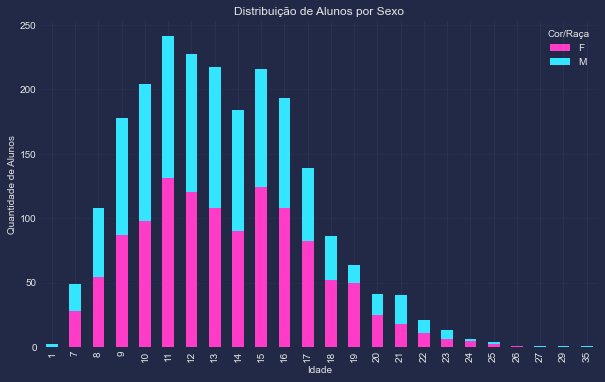

Podemos observar que uma <b>concentração nas idades de 10 a 11 anos</b> e uma <b>predominancia do sexo feminino</b>.

Em seguida, analisamos os alunos por suas etnias.

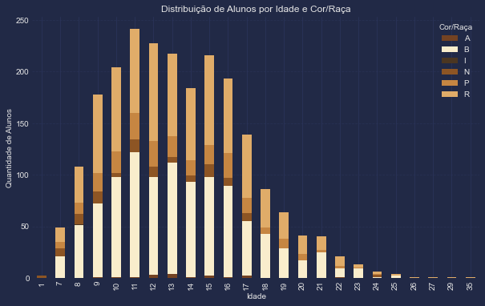

Aqui podemos observar uma <b>concentração das classificações "B" e "R".</b>

Após isso verificamos a questão dos pais cadastratados como responsáveis, desta forma podemos ver se há alguma impacto:

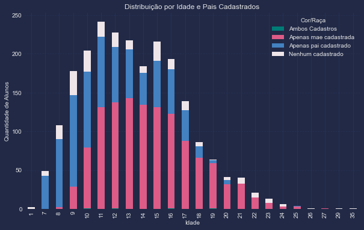

Concluímos que <b>até os 9 anos é mais comum os alunos terem apenas o pai cadastrado</b> como responsável, porém a partir de <b>10 anos idade observamos que há uma mudança forte e os alunos possuem apenas a mãe cadastrada.</b> Outro ponto importante de informar é observamos alguns alunos que não possuem nenhum dos pais cadastrados, mas nenhum aluno com ambos cadastrados.

Para um entendimento melhor, decidimos olhar as visões para cada um dos sexos dos alunos.

### Masculino:

- Gráfico de etnia:

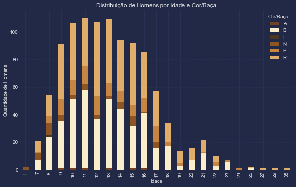

- Gráfico de Status Responsável:

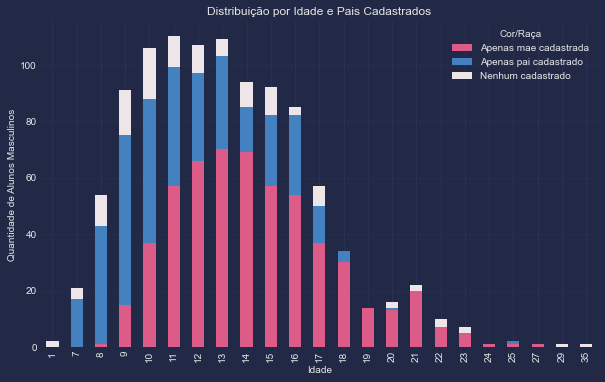

### Feminino:

- Gráfico de etnia:

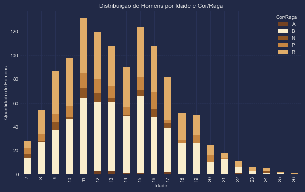

- Gráfico de Status Responsável:

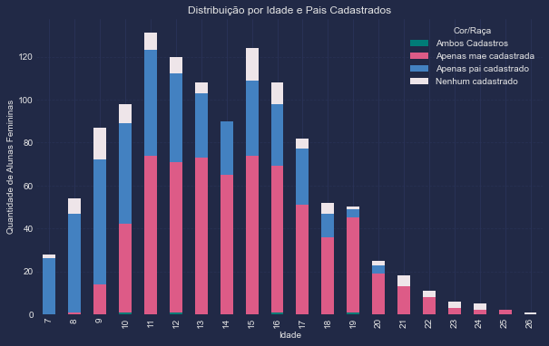

### Histórico dos Alunos

Identificamos que a base só possuia 124 alunos distintos, apesar disso seguimos a analise em cima da amostra que temos.

- Iniciamos verificando as distribuições de etnia pelos anos de conclusão do projeto:
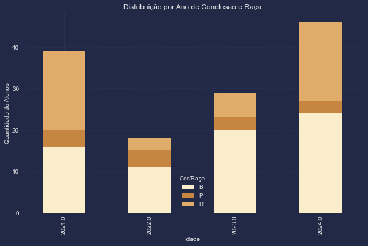

Observamos que houve uma <b>queda no número de alunos de 2022</b> e após esta data o público <b>majoritariamente é classificado como a etnia "B"</b>.

- Após isso, criamos a seguinte visão para verificar qual seria o sexo mais predominante a finalizar o projeto:
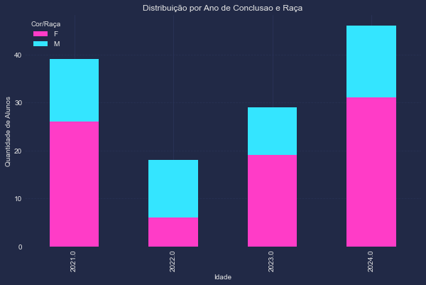

Vemos que há uma <b>tendência maior do sexo feminino concluir o projeto</b>, apesar de 2022 o sexo masculino ter sido maior.

- Montamos também a visão correlacionando o cadastro do responsável com o ano de conclusão:
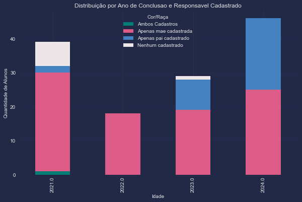

Observa-se nos <b>anos 2021, 2022 e 2023 que há um forte indício daqueles que possuem a mãe cadastrada a finalizar o projeto</b>. Entretanto, no ano de <b>2024 houve um aumento dos que possuem apenas o pai cadastrado</b> (não havendo nenhum aluno onde não possuia nenhum responsável), possivelmente possa sinalizar uma mudança no padrão ou um ano outlier.

O último gráfico que criamos neste arquivo foi o de resultado de conclusão por etnia:

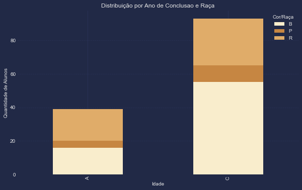.

Com toda esta análise feita, exportamos o arquivo <b>'bases_finais/alunos.csv'</b> com as informações acima para que possamos criar um dashboard interativo no Looker. 

# Segunda Etapa

A segunda etapa foi de criação do dashboard interativo, desta forma o usuário terá mais idependencia e poderá criar suas próprias análises.

Link para acessar o dash:

    https://lookerstudio.google.com/reporting/7450813a-7302-488a-a011-fc6d0ff02861

Foram replicadas as mesmas visões de nosso estudo, no dash. Ficando da seguinte forma:
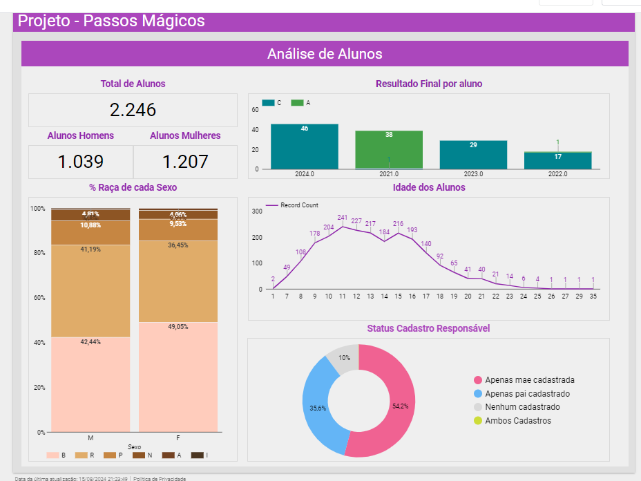

# Terceira Etapa Conclusões Finais
